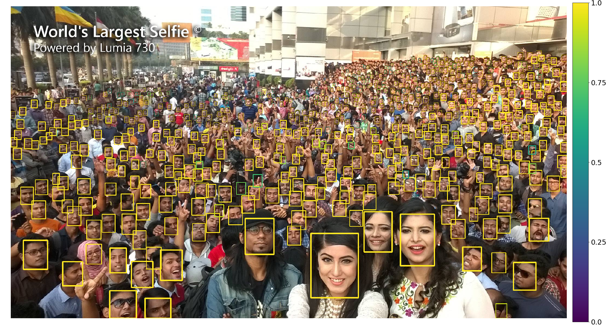
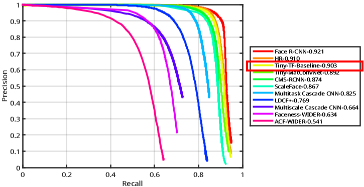

# Tiny Face Detector - tf
This is tensorflow version of [Finding Tiny Faces][paper-link] by Peiyun Hu, Deva Ramanan. \
Instead of transforming pretrained network parameters from .mat file, this code solely train the network from scratch with [Tensorflow][tf] only.

[paper-link]:https://arxiv.org/pdf/1612.04402.pdf
[tf]:https://www.tensorflow.org/

**NOTE:** The paper is not a work of mine, you should checkout the original paper's [repo][tiny].

[tiny]:https://github.com/peiyunh/tiny

## Requirements
`python=2.7 tensorflow-gpu numpy scipy scikit-learn matplotlib opencv-python Cython easydict pyyaml`

The majority of the code was written with Python 2.7 and [Tensorflow r1.2][tf-link], it should be fine running on newer versions as well. If there are any compatibility issues, please feel free to submit it. \
You may also need a decent GPU to be able to train the network, anything with higher than 6GB GPU memory should suffice.

[tf-link]:https://storage.googleapis.com/tensorflow/linux/gpu/tensorflow_gpu-1.2.0-cp27-none-linux_x86_64.whl


## Basic setup
1. Download WIDER Face Training & Validation Dataset:\
   http://mmlab.ie.cuhk.edu.hk/projects/WIDERFace/ \
   The extracted directories were expected to be in the order like this:
    ```bash
    WIDER/
    ├── WIDER_train/
    │   └── images/..
    │
    ├── WIDER_val/
    │   └── images/..
    │
    └── wider_face_split/...
    ```
2. Bulid two pickle files based on training and validation dataset:
    ```Shell
    python lib/utils/wider2pkl_detail.py --img_root $WIDER/WIDER_train/images \
     --label $WIDER/wider_face_split/wider_face_train.mat \
     --out wider_train_roidb_detail.pkl 
    ```
    ```Shell
    python lib/utils/wider2pkl_detail.py --img_root $WIDER/WIDER_val/images \
    --label $WIDER/wider_face_split/wider_face_val.mat \
    --out wider_val_detail.pkl
    ```
    Both process may take a few minutes to complete, place the two generated .pkl files into ```data/pickles```
3. Compile minibatch for data IO:
    ```Shell
    cd $tiny-tf/lib/roi_data_layer
    python setup.py build_ext –inplace 
    ```
    (Any further modifications in ```minibatch.pyx``` will require re-compiling in order to take effect.)

## Demo
You can quickly test out the code with pretrained network [tensorflow checkpoint][tf-ckpt], make sure to place the whole directory ```Resnet101_tiny``` into ```$tiny-tf/output```.

1. Place pictures into ```$tiny-tf/demo/data```
2. Execute ```demo_tiny_resnet101.sh``` 
3. Detection result should be right in the ```$tiny-tf/demo/visualize```

The result will look like this:
<p align="center">

<p>

[tf-ckpt]:https://drive.google.com/open?id=1sCoVxcCvu-bL0uNJj-3_mRqDNUfWzQKX

## Training
1. Make sure training set pickle file ```wider_train_roidb_detail.pkl``` is in  ```$tiny-tf/data/pickles```
2. Download the [Imagenet pretrained model][ImageNet_Res101] and place into ```$tiny-tf/data/pretrain_model```
3. Execute ```tiny_resnet101_wider_train.sh```

You can tweak settings and hyperparameters in ```cfgs/tiny_resnet101.yml```\
The generated tensorboard will be in ```$tiny-tf/log``` folder, checkpoints will be in ```$tiny-tf/output```.

[ImageNet_Res101]: https://drive.google.com/open?id=1in08YStK2sUEirj8VCtgSB_ADZZJ36-b

## Validation
1. Make sure validation set pickle file ```wider_val_detail.pkl``` is in  ```$tiny-tf/data/pickles```
2. Execute ```tiny_resnet101_eval.sh```, validation will run through a couple thousands of images, so it may take a while.
3. The test result will be saved as a single ```pred``` directory, and the format comply with official WIDER-Face dataset [evaluation code][eval_tool_link], you can use eval_tool to inspect the result.

The following PR-curves shows validation __medium__ set result of pre-trained model ```Resnet101_tiny```
<p align="center">

<p>

__NOTE:__ The validation result above does not contain the other most recent state-of-the-art result, it merely shows our training result perform nearly good as paper.

[eval_tool_link]:http://mmlab.ie.cuhk.edu.hk/projects/WIDERFace/WiderFace_Results.html#Evaluation

## References
This code was done by referencing some of the following awesome repo, it's good to check them out :)
#### [peiyunh/tiny][tiny]
#### [smallcorgi/Faster-RCNN_TF][faster-rcnn-tf]
#### [rbgirshick/py-faster-rcnn][faster-rcnn]
#### [shekkizh/FCN.tensorflow][fcn-tf]

[faster-rcnn-tf]:https://github.com/smallcorgi/Faster-RCNN_TF
[faster-rcnn]:https://github.com/rbgirshick/py-faster-rcnn
[fcn-tf]:https://github.com/shekkizh/FCN.tensorflow